# MocUT SVD: Singular Value Decomposition via Monoclinic Unitary Transformations

**Johannes B. Steffens**

#### Technical Whitepaper, March 2026

## Introduction

The [Singular Value Decomposition](https://en.wikipedia.org/wiki/Singular_value_decomposition) decomposes a *m x n* Matrix *M* into Matrices $U$, $\Sigma$ , $V$ such that $\Sigma$ is [diagonal](https://en.wikipedia.org/wiki/Diagonal_matrix) and  $U$, $V$ are both [unitary](https://en.wikipedia.org/wiki/Unitary_matrix) and $M = U \cdot \Sigma \cdot V^\ast$. 

The docomposition exists for any matrix. Designing a fast, numerically stable and well scalable SVD algorithm, however, offers challenges.

Since, the method is fundamentally important in linear algebra and has many use cases in science and engineering, overcoming these difficulties seems a worthy goal.

MocUT SVD resulted from my research on platform agnostic computational efficiency to achieve [true scalable](true_scalability.md) [1] SVD. I discovered a symmetry in all phases of the computation that can be utilized for this goal. It yielded an oblique pattern of unitary transformations, which I call *Monoclinic Unitary Transformation* (MocUT). This method offers a performance advantage over other contemporary SVD algorithms on (homogenous) general purpose multi-core CPUs.

This document first covers traditional methods of performing the SVD and then focuses on the MocUT algorithm in detail.

## Matrix Decomposition

Lets express matrix $M$ by a generic decomposition $U$, $A$, $V$ of which $U$, $V$ are unitary. For the moment $A$ can be any matrix. 

**(1)** 	$M = UAV^\ast$

A trivial decomposition would be: $U = V = \underline{1}$ and $A = M$.

Since the product of a unitary matrix with its adjunct $(P^\ast P)$ is the unity and the product of two unitary matrices is also unitary, we can convert a decomposition into another:

**(2)** 	$UAV^\ast = U(P^\ast P)A(Q^\ast Q) V^\ast = (UP^\ast)(PAQ^\ast)(QV^\ast) = U_{new} A_{new} V_{new}^\ast$

Equation (2) represents an incremental step.

Most decomposition algorithms use this approach to convert A incrementally into a desired shape. The incremental conversion on $U$ and $V$ is called ***back-transformation***. It can be omitted when $U$ or $V$ are not needed.

Frequently used decompositions are:

**QRD**: $A$ is upper triangular; $V$ remains unity; only $P_i$ are needed.

**LQD**: $A$ is lower triangular; $U$ remains unity; only $Q_j$ are needed.

**SVD**: $A$ is diagonal; both: $P_i$, $Q_j$ are needed.

There are many possible different UT-sequences for the same decomposition. An algorithm can be described by the specific sequence it employs.

There are two commonly used classes of incremental unitary transformations: 

* The **Givens Rotation** 
* The **Householder Reflection**

## Givens Rotation

The [Givens Rotation](https://en.wikipedia.org/wiki/Givens_rotation) (GR) is a unitary transformation, which applies a 2D rotation on a 2D Vector. It is defined by a rotation angle $\phi$. 

With $a=cos(\phi)$ and $b = sin(\phi)$:

$v_1 \rightarrow av_1 - bv_2$

$v_2 \rightarrow bv_1 + av_2$

The left-side rotation $G \cdot A$ on a matrix $A$ only affects two rows in A. The right-side rotation $A \cdot G$ only affects two columns in A. Both cases can be implemented as a sequence of independent 2D vector rotations, where the i-th 2-vector represents the i-th element in the two affected rows/columns. Hence, the matrix operation has a natural [inner parallelity](true_scalability.md#inner-parallelity).

On a [row-major layout](true_scalability.md##data-layout) the left-sided operation is well-scalable with minimal DRAM bursts, the right-sided operation is not. Hence: If possible the left-sided operation $G \cdot A$ should be preferred over the right-sided $A \cdot G$.

A single Givens Rotation can be used to set one value in A to zero. With a strategic placement of multiple rotations, one can set a specified area in A to zero.

## Householder Reflection

The [Householder Reflection](https://en.wikipedia.org/wiki/Householder_transformation) (HR) is a self-adjoint unitary transformation determined by a normalized vector $w$. It is expressed in matrix-form as follows:

$w^\ast w = 1$

$H_w = \underline{1} - 2 ww^\ast$ 

$H_w$ is unitary because

$H_w^\ast H_w = H_w H_w^\ast = (\underline{1} - 2 ww^\ast )( \underline{1} - 2 ww^\ast ) = \underline{1} - 4w w^\ast + 4w w^\ast w w^\ast = \underline{1} $

The HR is numerically efficient because $H_w(v) = \underline{1}-2w(w^\ast v)$, which has a complexity of $O(n)$, ($n$ = dim( $v$ )). 

The left-side reflection $H \cdot A$ affects $n$ rows in A. The right-side reflection $A \cdot H$ affects $n$ columns in $A$. 

The HR can be configured to set $n-1$ values in a vector to zero. A strategic placement of multiple HR, one can set a specified area in a matrix $A$ to zero. 

GR and HR both can be used to achieve the same goal. Asymptotically ($n \gg 1$) a Householder reflection requires 25% fewer numeric operations than a corresponding sequence of ($n-1$) givens rotations. On the other hand, Givens rotations are more localized.

HR on a single vector has no natural [inner parallelity](true_scalability.md#inner-parallelity), however, it can be performed with inner parallelity on a level 2 matrix-operation. We will show further down how it is done.

## The Golub-Reinsch SVD Approach

The Golub-Reinsch Algorithm [2] is a classic and popular SVD algorithm. It is composed of two processing-phases:

1. **Bi-Diagonalizing $A$ via alternating left and right Householder reflections.**
2. **Diagonalizing $A$ via alternating left and right Givens rotations: GR-Chasing.**

Bi-Diagonalizing means: Zeroing all elements in $A$, except the main diagonal and one immediate sub-diagonal of $A$.

Phase 1 iterates on a lower-right block matrix. Each iteration adds a new bi-diagonal row and column to the upper and left section of $A$ and shrinks the residual block accordingly. It is done by zeroing leftmost non-zero column under the main-diagonal via $P_i$ , then the uppermost non-zero row right from the sub-diagonal via $Q_i$. This can be achived with Householder transformation as depicted in the following figure:

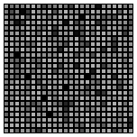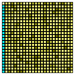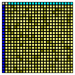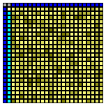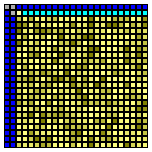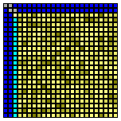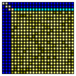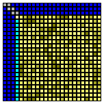 **....** 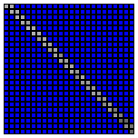

**Figure 1:** Bi diagonalizing $A$ with alternating left and right Householder transformations. 

##### Color-Scheme 

* Gray: Unchanged
* Yellow: Changed values
* Cyan: Newly zeroed values
* Blue: Already zeroed values.


$P_i$ and $Q_i$ are tightly coupled: To determine $P_i$, the $i$-th column of $(A_{i-1}Q_{i-1}^\ast)$ must be known. To determine $Q_i$, the $i$-th row of  $(P_i A_{i-1})$ must be known. Consequently all of the residual not yet bi-diagonalized portion of A must be accessed before the next UT can be computed. This thwarts data-locality an severely limits [outer-parallelity](true_scalability.md#outer-parallelity) because the outermost loop is fairly long and not independent.

Hence, phase 1 in the Golub-Reinsch Algorithm is not [true-scalable](#true_scalable).

Bi-diagonalization is the best one can achieve in a closed form (meaning: a predictably finite set of transformations). Any attempt to zero an element in the sub-diagonal with a single unitary transformation will re-insert non-zeros somewhere else in the matrix.

Therefore the second stage is a an iterative approximation, by which $A$ converges into diagonal form. Theoretically, infinitely many cycles are needed for the exact solution. However, the convergence is so fast that an approximation with negligible residual error can be achieved with few cycles. Francis [3] [4] developed a practical algorithm for symmetric matrices. Later, Golub, Reinsch [2] [5] generalized it by devloping an efficient and stable solution (chasing algorithm) for any matrix.

Describing this algorithm goes beyond the scope of this document. At this point, it shall suffice to mention that the computational effort on $A$ alone is (nearly) negligible compared to phase 1 and therefore needs no specific consideration with respect to parallelity. The back-transformation on $U$ and $V$, on the other hand, is computationally expensive and needs careful optimization. We will later pick up certain details to describe how the chasing-phase can be made [true-scalable](#true_scalable).

## The DC Approach

For sake of completeness, we briefly mention that for diagonalizing a bi-diagonal matrix, a stable and efficient divide an conquer approach has been developed by Ming Gu et al. [10]. The DC-approach is significantly different from the Golub-Reinsch GR-chasing. The DC-Approach appears to run faster at similar stability. It has been adopted by popular SVD software libraries. However, we did not utilize the DC-Idea in MocUT-SVD.

## The 3-Phase Band-Diagonal SVD Approach

The band-diagonal approach was proposed by B. Lang [8] in order to overcome the limitations of the single phase bi-diagonalization.

It can be achieved by splitting it into two stages such that we get three phases altogether:

1. **Band-Diagonalizing $A$**.
2. **Bi-Diagonalizing a band-diagonal $A$**.
3. **Diagonalizing $A$**

Phase 3 can either be the [GR-Chasing](#the-golub-reinsch-svd-approach) algorithm or the [DC approach](#the-dc-approach).

Band-Diagonalizing means: Zeroing all elements in $A$ except the main diagonal and a band of $n_b$ immediate sub-diagonals of $A$. This is done by alternating zeroing a block of $n_b$ left columns and $n_b$ upper rows. (s. Figure 2)

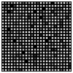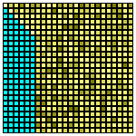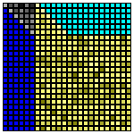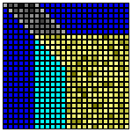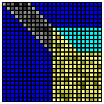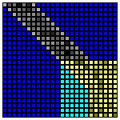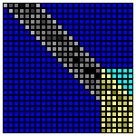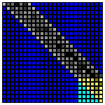

**Figure 2:** Band diagonalization with alternating left and right blocks of Householder transformations. (See also [Color Scheme](#color-scheme))

Within a single block $P_i$ and $Q_i$ are decoupled: To compute $P_i$, only those rows of $A$ need be known upfront, which are to be zeroed. In a transposed manner the same applies to $Q_i$. 

An accumulated bundle of one-sided householder reflections is converted into an efficient matrix-matrix multiplication by the WY-representation of accumulated Householder Reflections [9]. 

B. Lang presented 1996 an efficient algorithm for phase 2 (Band-Diagonal to Bi-Diagonal)[7]. It uses left and right HR in a to reduce the banded matrix to bi-diagonal. The following figures depicts the process.

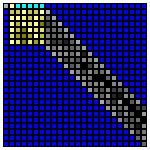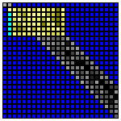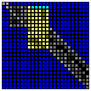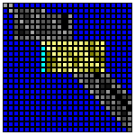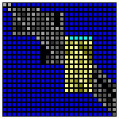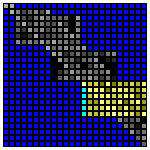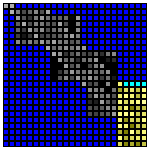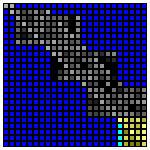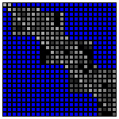

**Figure 3a:** First sweep: With alternating left and right Householder transformations the upper-left row and column is bi-diagonalized.

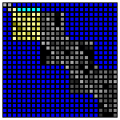  **...**  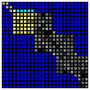  **...** 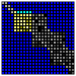  **...**  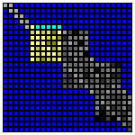  **...** ,,, **...**  

**Figure 3b:** The sweep in figure 3a is repeated on the residual lower-right partition until the entire matrix is bi-diagonal.

The operations temporarily introduce off-band non-zeros in A, which will be chased down with alternating left and right HR. The process is fairly cheap on $A$, requiring only $O(n^2n_b)$ operations. With typically $n_b \ll n$, significant parallelization is not needed on $A$.

The back-transformation on $U,V$, on the other hand, has approximately the same complexity as band-diagonalization. Therefore, this part should be done with careful optimization.  B. Lang [9] showed that the back-transformations can be rearranged in a cache-efficient manner and he suggests using the WY-representation for accrued left and right HR.

Subsequent work focused on adapting the 3-phase solution using the BLAS framework on specialized or heterogenous hardware [11], [14].

## The MocUT Algorithm

The MocUT SVD is a 3-phase algorithm. Its distinction from the previously discussed 3-phase approach is its usage of accrued unitary transformations. It does not attempt use the WY-Representation, is not dependent on a specific BLAS-framework and it is designed for general purpose CPUs rather than specialized hardware. It achieves its performance advantage by chopping up the sequence of transformation into a set of suitable *"atomic"* transformations, and then finding a permutation with improved [data-locality](true_scalability.md#data-locality)

To describe this approach, we begin with the observation that for all time-critical operations, we can use a set of accrued unitary transformations: In Phase 1, this applies to matrices $A$, $U$ and $V$. In Phases 2 and 3, only back-transformations on $U$ and $V$ are relevant: Residual computational effort on band-diagonal $A$ is negligible in comparison.

Let's assume we have a set of accrued unitary transformations.

$P = \prod_i P_i$

$Q^\ast = \prod_j Q_j^\ast$

$U$ and $V$ shall be stored in their (conjugate) transposed form. Then matrices will be updated as follows

$A \rightarrow \left( \left( P A \right) Q^\ast \right)$

$U^\ast \rightarrow P U^\ast$

$V^\ast \rightarrow Q V^\ast$

In this setting, we are facing mostly left-sided atomic transformations, so we focus on analyzing this form and generalize where appropriate.

### Monoclinic block-transformation

### Phase 1

Let's look at the left-sided band-operation in phase 1, which zeros a band of columns at once, as depicted in figure 2.

We can describe it as a sequence of householder reflections, each zeroing a column on A:

**(1)**	$P = \prod_i P_i$


Each operation changes nearly the entire matrix. It has therefore poor data-locality. We want to find a different set of transformations with better locality. We do this by subdividing each $P_i$ into a chain of smaller transformations, each affecting a smaller section of rows as shown below:

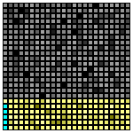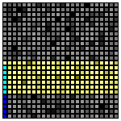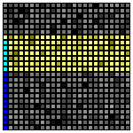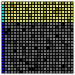 **...**

**Figure 4:** Zeroing a row by multiple smaller atomic transformations, each affecting a contiguous section of rows.

**(2)**	$P_i = \prod_j P_{i,j}$

We call the $P_{i,j}$ ***atomic*** when each is affecting a portion of contiguous rows in the matrix, which is small enough for cache efficient block-operations. Atomic transformations could be Householder reflections or a sequence of adjacent Givens rotations.

Note that each must overlap with the preceding operation by exactly one column. That is because for a transformation affecting $n$ rows, only $n - 1$ values are zeroed. 

With **(1)** and **(2)**, we get

**(3)**	$P = \prod_i \left( \prod_j P_{i,j} \right)$

It is easy to see that $P_{i1}$ affects the bottom part of the matrix, $P_{i2}$ the next portion above it and so on. So, performing transformations with same $k$ together should have better locality. We seek a $P$-invariant permutation that swaps the sequence-order in $i$ and $j$:

**(4)**	$P = \prod_j \left( \prod_i P_{i,j} \right)$

**(5)**	The permutation **(3)** $\rightarrow$ **(4)** is valid when $P_{i,j}$ and $P_{k,l}$ are commutative $\forall ( j>l \and i < k )$.

Condition **(5)** requires $P_{i+1,j}$ and $P_{i,j + 1}$ to be commutative. Since $P_{i,j}$ and $P_{i,j + 1}$ overlap by one row, we must provide extra  clearance for $P_{i+1,j}$. We therefore choose $P_{i+1,j}$ to overlap with the rows of $P_{i,j}$ but shifted down by one row: If  $P_{i,j}$ affects rows $\{4,5,6,7\}$, then $P_{i+1,j}$ affects rows  $\{5,6,7,8\}$ and so on. When the bottom of the matrix is reached, the transformation would be truncated accordingly. This generates an oblique pattern as depicted in figure 5. 

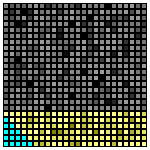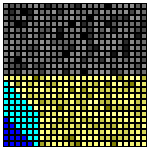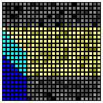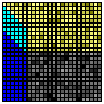 **...**

**Figure 5:** Left-sided operation during band-diagonalization. The re-bundled atomic transformations form a local block with an oblique pattern. We call it ***<u>Mo</u>no<u>c</u>linic <u>U</u>nitary <u>T</u>ransformation*** (MocUT).

We can easily see that each atomic transformation within a block reuses most of the rows such that the modified matrix data is more condensed and thus offers high cache-efficiency. 

This ordering forms a characteristic oblique block-pattern. It is slanted in one dimension and straight otherwise. 

In crystallography, certain crystal systems are called [monoclinic](https://en.wikipedia.org/wiki/Monoclinic_crystal_system). In a 2D projection, these would exhibit the same slanted shape, which inspired the name for this unitary operation.

All observations, we made for left-sided operations, apply to right-sided operations in transposed fashion. 

The figure below depicts the entire phase 1 operation:


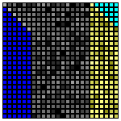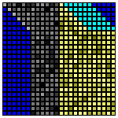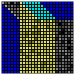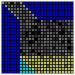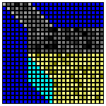 **...** 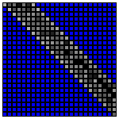

**Figure 6:** Phase 1 band-diagonalization with monoclinic unitary transformations.

#### Non Square Matrices

We should point out that all row and column operations described here are size- and ratio-agnostic. 

If the matrix is square or portrait shaped (rows >= columns), one can compute the upper-band-diagonal. If it is landscape-shaped, one can compute the lower-band-diagonal. This makes the band always reside in the upper-left square partition of $A$ and the remaining partition of $A$ being all zero. Phases 2 and 3 can then concentrate on the square partition of A.

### Phase 2

Recall that phase 2 uses atomic transformations in multiple sweeps. Each sweep extends the bi-diagonal portion by one row and column. For of simplicity we keep using the notation $P_{i,k}$ for left-transformations  *-- just remember, that these are not the same as in phase 1 --* ;  $i$  shall denote the sweep-number and $j$ the atomic-step within a sweep.

$P_{1,1}$$P_{1,2}$$P_{1,3}$$P_{1,4}$

$P_{2,1}$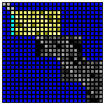$P_{2,2}$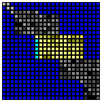$P_{2,3}$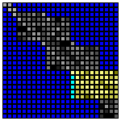$P_{2,4}$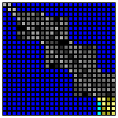

$P_{3,1}$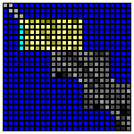$P_{3,2}$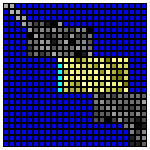$P_{3,3}$$P_{3,4}$

​		**...**

**Figure 7:** Phase 2 left transformations: $P_{\text{sweep-number},\text{atomic-step}}$

Within a sweep, all atomic transformations affect affect disjointed rows. Therefore the back-transformation could also be done in reverse order. Furthermore, if we look (vertically) at the same atomic-step in subsequent sweeps, we find that the affected rows are shifted down by one row. 

So, the back-transformation on $U$ could be done in this order:

$P_{1,4} \rightarrow P_{2,4} \rightarrow P_{3,4} \rightarrow \ldots \rightarrow$

$P_{1,3} \rightarrow P_{2,3} \rightarrow P_{3,3} \rightarrow \ldots \rightarrow$

$P_{1,2} \rightarrow P_{2,2} \rightarrow P_{3,2} \rightarrow \ldots \rightarrow$

$P_{1,1} \rightarrow P_{2,1} \rightarrow P_{3,1} \rightarrow \ldots$

These form the same monoclinic patterns as described in phase 1. Therefore, we can construct practically the same algorithm as used in phase 1: In phase 1 is the monoclinic tiles overlap by one row. In phase 2 they do not, which minor detail is easy to be parametrized.

### Phase 3

Phase 3 of MocUT SVD is based on bi-diagonal to diagonal phase by the Golub-Reinsch approach [2] [12]. The operations on $A$ yield a sequence of adjacent Givens rotations for the back-transformation on $U^\ast$ and $V^\ast$: These rotations operate on a contiguous partition in multiple cycles. Each cycle process rows in that partition from top to bottom. Each single rotation affects two adjacent rows. Two subsequent rotations within a cycle affect two subsequent pairs of rows, which overlap by one row. 

Within a cycle, we combine a set of maximally $n$ subsequent givens rotations to form an atomic unitary transformation, which affects $n+1$ rows. Two subsequent atomic transformations within a cycle overlap by one row. This transformation pattern is the same as in phase 1 except that we use Givens rotations instead of Householder reflections and the direction of preocessing rows is reversed. We can therefore apply the same reasoning to construct a permutation that forms data-local blocks of accrued transformations. Because subsequent atomic transformations overlap by one row, these blocks assume a monoclinic shape in the same manner as already described in [phase 1](#phase-1). 

### Outer Parallelity

(See also [True Scalability: Outer parallelity](true_scalability.md#outer-parallelity))

For left-sided transformation $PA$, $PU^\ast$, $QV^\ast$ we can partition the operand into multiple blocks of columns. The transformation is independent across blocks and can therefore run in parallel (e.g. one thread per block). For left sided operations ($AQ^\ast$) the same reasoning applies by partitioning the operand into blocks of rows.

For optimal efficiency, as many transformations as possible should be accrued before splitting the processing into independent threads. For transformations on $A$, outer-parallelization is only required (and feasible) for phase 1. Back transformations on $U^\ast$ and $V^\ast$ can be done in parallel in all three phases.

### Temporary Storage of atomic Transformations

For optimal outer parallelity many atomic transformation should be collected before applying them. Storing can be efficiently done by temporarily re-purposing the space of matrix A, which has already been zeroed.

The Householder reflection is defined by its $n$-dimensional vector $w$. 

The transformation is invariant to negating $w$: $H_w = \underline{1} - 2 ww^\ast = \underline{1} - 2 (-w)(-w)^\ast$. We therefore may choose $w$ such that its first component has a predictable sign (e.g. non-negative). Then, we only need to store the $n-1$ remaining components of $w$, and reconstruct the first one from the condition $w^\ast w = 1$.

In phase 1, each transformation zeros $n-1$ values in $A$. Hence, all zeros offer enough space to store all transformations of phase 1.

One can also show that phase 2 always offers enough zero-space in $A$ to temporarily store all needed transformations.

G. W. Stewart [13] presented an economical and numerically stable way to store givens rotations (one value per rotation) without the need to use expensive trigonometric operations for storage or reconstruction. We use that method for temporary storage in phase 3. Since phase 3 is an iterative approximation algorithm, we store a specified amount of rotations and consume them by running the back-transformation at suitable intervals.

### Inner Parallelity

(See also [True Scalability: Inner parallelity](true_scalability.md#inner-parallelity))

#### Householder Reflection

Lets have a closer look into the left-sided atomic (n x n) householder transformation $H$ on a (m x n)-partition $T$ of a matrix:

**(1)**	$T \rightarrow HT$

$T$ could be a partition in $A$, $U^\ast$ or $V^\ast$.

The transformation is defined by the n-vector $w$:

**(2)**	 $H_w(v) = \underline{1}-2w(w^\ast v)$

$v$ would be a column vector in $T$.

If we denote an (i,j)-element in T as `t[i][j]`, the transformation **(1)**,**(2)** could naively be implemented as follows:

**Example 1:**

``` C
for( int j = 0; j < n; j++ )
{
    double s = 0;
    for( int i = 0; i < m; i++ ) s += w[i]*t[i][j]; // (!) no inner parallelity
	for( int i = 0; i < m; i++ ) t[i][j] -= 2*w[i]*s;
}
```

This implementation has two flaws: 

* The inner loop passes through a column of $T$. This is inefficient in a row-major layout.
* The first inner loop has no independent cycles. (Misses inner parallelity)

We can fix both flaws by re-organizing  the algorithm as follows:

**Example 2:**

``` C
double b[n] = { 0 };

for( int i = 0; i < m; i++ )
    for( int j = 0; j < n; j++ ) b[j] += w[i]*t[i][j];

for( int i = 0; i < m; i++ )
    for( int j = 0; j < n; j++ ) t[i][j] -= 2*w[i]*b[j];
```

In example 2 a buffer-vector `b` is used to accumulate all n dot-products. On row-major matrices with appropriate compiler optimizations, Example 2 will run more efficiently.

Partitioning is done such that $T$ fits entirely into the L1-cache of the platform. This normally means that `n` is small enough to place $b$ onto stack-memory.

#### Givens Rotation

All time critical Givens rotations are left-sided. A sequence can easily be applied on a row-major layout with inner parallelity on a (m x n)-partition $T$ of a matrix. In the example be low we assume the all rotations are decomposed into cosine and sine-components: $a_i = cos(\phi_i)$, $b_i = sin(\phi_i)$.

**Example 3:**

``` C
for( int i = 0; i < m-1; i++ )
{
    for( int j = 0; j < n; j++ )
    {
        double tij = t[i][j];
        t[i  ][j] = tij * a[i] - t[i+1][j] * b[i];
        t[i+1][j] = tij * b[i] + t[i+1][j] * a[i];
    }
}
```


## GitHub

MocUT SVD is publicly available on a github repository under the following link: https://github.com/johsteffens/mocutsvd
This solution contains some additional improvements not covered in this document: Enhanced stability, enhanced numeric accuracy and a few speed related improvements.

[mocutsvd](https://github.com/johsteffens/mocutsvd) was designed to be easily usable in an application or to be added to a linear-algebra library. I used a permissive royalty-free license in the hope that it receives adoption.

## Performance

The performance was tested on different platforms, each containing the following steps

* Initialize an ($n$ x $n$) matrix $M$ with random values.
* Run the SVD $M \rightarrow U^\ast, \Sigma, V^\ast$ and measure the absolute time required.
* Verify the correctness of the result.

Tested was the implementation in `mocutsvd.c` and  `mocutsvd.h`. The code was compiled using `gcc` with flags `-fopenmp -march=native -O3`.

Platforms with the following general purpose CPUs were used:
* `TR 7960`: AMD Ryzen™ Threadripper™ 7960X, containing 24 cores
* `RZ 5900`: AMD Ryzen™ 9 5900X, containing 12 cores
* `i7 7700`: Intel® Core™ i7-7700, containing 4 cores

The chart below shows the absolution computation time across different values of $n$.


**Figure 8:** Absolute processing time in seconds for a full decomposition of a ($n$ x  $n$) matrix: $M \rightarrow U^\ast, \Sigma, V^\ast$. The charts represent 3 different CPUs.

## Conclusion and Outlook

We presented a new platform-agnostic algorithm for general purpose singular value decomposition. The methods used are designed to remain portable in consideration of likely future developments in computing hardware.

The implementation does not need hardware-specific code. The presented solution can achieve compettive performance just with standard optimizing compiler. 

We do not explicitly use SIMD instructions. While the compiler might utilize SIMD instructions for optimization, there are indications that the most recent SIMD instruction sets (e.g. AVX-512) were not used in our test-compilatios.

We have not investigated the DC-SVD. Combining the MocUT approach with DC-SVD might yield further improvements.

### Recent related work

After my own research and most of the coding was completed but not yet published, I became aware of a 2025 publication by H. Wang et al. [14].
It focuses on EVD-BLAS adaptation and argues that BLAS2 operations in eigenvalue decompositions can be superior to BLAS3 operations. In this paper, the authors take a similar stance towards back-transformation as I do. Their algorithm appears to be differnt from mine, though, and their focus is heterogeneous platforms.

## Web References

The following references were used as inline links thoughout the document:

https://en.wikipedia.org/wiki/Singular_value_decomposition

https://en.wikipedia.org/wiki/Diagonal_matrix

https://en.wikipedia.org/wiki/Unitary_matrix

https://en.wikipedia.org/wiki/Householder_transformation

https://en.wikipedia.org/wiki/Givens_rotation

https://en.wikipedia.org/wiki/Monoclinic_crystal_system

https://github.com/johsteffens/mocutsvd

## Literature

[1] Johannes B. Steffens, True Scalability, Technical Whitepaper 2026, [true-scalability.md](true-scalability.md)

[2] G. H. Golup, C. Reinsch: Singular Value Decomposition and Least Squares Solutions; Numerische Mathematik (Journal) Vol. 14, Issue 5, Apr 1970, Pg 403-420

[3] J. G. F. Francis: The Q R transformation. A unitary analogue to the L R transformation - Part1; *The Computer Journal*, Vol. 4, Issue 3, Jan 1961, Pages 265–271, https://academic.oup.com/comjnl/article/4/3/265/380632

[4] J. G. F. Francis: The Q R transformation – Part 2. *The Computer Journal*, Vol. 4, Issue 4, Jan 1962, Pages 332–345, https://academic.oup.com/comjnl/article/4/4/332/432033

[5] Walther Gander: The First Algorithms to Compute the SVD; The Third International Workshop on Matrix Computations, Lanzhou University, April 15 – April 19, 2022, https://people.inf.ethz.ch/gander/talks/Vortrag2022.pdf

[6] Stoer – Bulirsch; Numerische Mathematik 2, Chapter 6, ISBN 3-540-23777-1

[7] Bruno Lang, Parallel reduction of banded matrices to bidiagonal form, Parallel Computing, Volume 22, Issue 1, 1996, Pages 1-18, ISSN 0167-8191, https://doi.org/10.1016/0167-8191(95)00064-X.

[8] Benedikt Großer, Bruno Lang, Efficient parallel reduction to bidiagonal form, Parallel Computing,
Volume 25, Issue 8,1999, Pages 969-986, ISSN 0167-8191, https://doi.org/10.1016/S0167-8191(99)00041-1.

[9] Christian H. Bischof, Charles Van Loan, The WY representation for products of householder matrices, SIAM J. Sci. Stat. Comput. Vol 8, Iss. 1 (1987), https://epubs.siam.org/doi/10.1137/0908009

[10] Ming Gu, Stanley C. Eisenstat, A Divide-and-Conquer Algorithm for the Bidiagonal SVD, SIAM J. Matrix Anal. Appl., 1995, Vol. 16, Pages 79-92, https://api.semanticscholar.org/CorpusID:207080425

[11] Mark Gates, Stanimire Tomov, Jack Dongarra, Accelerating the SVD two stage bidiagonal reduction and divide and conquer using GPUs, Parallel Computing, Volume 74, 2018, Pages 3-18, ISSN 0167-8191,
https://doi.org/10.1016/j.parco.2017.10.004.

[12] G. H. Golub C.H. Van Loan, Matrix Computations 4th Edition, Chapter 8.6, ISBN: 978-1-4214-0794-4

[13]  G. W. Stewart, "The Economical Storage of Plane Rotations.", Numerische Mathematik 25 (1975/76): Pages 137-138, http://eudml.org/doc/132367

[14]  H. Wang et al. "Rethinking Back Transformation in 2-stage EigenvalueDecomposition on Heterogeneous Architectures", Proceedings of SC '25: The International Conference for High Performance Computing, Networking, Storage and Analysis: Pages 1830 - 1844, https://dl.acm.org/doi/epdf/10.1145/3712285.3759770

____

&copy; 2026 Johannes B. Steffens
